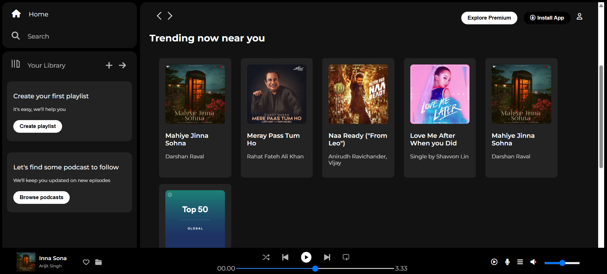

# Spotify UI Clone

 
> A static, visual replica of the Spotify web player interface, built using pure HTML and CSS to practice front-end development skills.

**Live Demo:** [Link to your live project here]

---

## 🚀 Project Overview

This project is a front-end-only clone of the Spotify web application. 
The primary goal was to replicate the complex and modern layout of the Spotify UI, focusing on structure, positioning, and styling with pure HTML5 and CSS3. 
It is a static project and does not include any backend functionality or JavaScript for interactivity.

## ✨ Features

Based on the provided code, here are the features you've successfully implemented:

* **Three-Column Layout:** A faithful reproduction of Spotify's iconic layout with a sidebar, main content area, and a fixed music player at the bottom.
* **Navigation Sidebar:** Includes navigation links, a library section with calls-to-action, and interactive hover effects.
* **Main Content Area:** Displays song and playlist cards organized into sections like "Recently Played" and "Trending," which are styled to match the original design.
* **Sticky Navigation Bar:** The top navigation bar remains fixed while scrolling through content.
* **Music Player UI:** A detailed, non-functional replica of the music player, including placeholders for album art, song info, player controls, and volume sliders.
* **Responsive Design:** Uses a basic media query to adjust the layout on smaller screens by hiding certain elements.

## 🛠️ Technologies Used

* **HTML5:** For the structure and content of the application.
* **CSS3:** For all styling, including Flexbox for layout, custom fonts, and hover effects.
* **Font Awesome:** For icons used throughout the user interface.
* **Google Fonts:** For importing the "Montserrat" font family to match Spotify's typography.

## 💡 Key Learnings

* **Advanced Layouts with Flexbox:** Gained experience in creating a complex, multi-column layout that remains consistent and structured.
* **Component-Based Styling:** Practiced styling individual components like navigation bars, cards, and buttons in a modular way.
* **Attention to Detail:** Focused on replicating small details like opacity, spacing, and font weights to achieve a pixel-perfect design.

## ⚠️ Disclaimer

This project is for educational purposes only and is not affiliated with Spotify. 
All assets, including images and icons, are used for demonstration and learning. 
The UI is static and does not have any real functionality.
